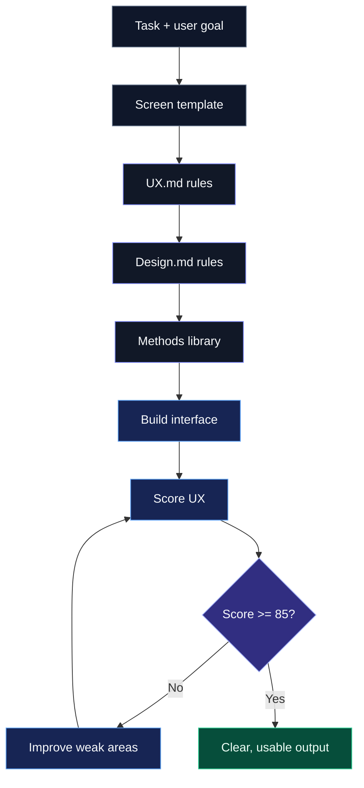

# UX + Design System (for AI-built apps)

A rule-based UX and design system for AI-built apps, turning proven principles into enforceable constraints that reduces friction, builds trust, and drives action.

→ Create your system: https://layrhq.io

---

## Table of Contents
- [What this is](#what-this-is)
- [What it’s based on / Methods](#what-its-based-on--methods)
- [Why it matters](#why-it-matters)
- [How the system works](#how-the-system-works)
- [Instructions](#instructions)
- [Goal](#goal)
- [License](#license)

---

## What this is

A rule-based UX + design system for AI.

It turns proven principles into strict rules the AI must follow when building.

---

## What it’s based on / Methods

- Hick’s Law - reduce choices  
- Cognitive Load - reduce thinking  
- Fitts’s Law - make actions easy  
- Jakob’s Law - use familiar patterns  
- Peak-End Rule - strong finish matters  
- Goal Gradient - show progress  
- Gestalt - clear structure  
- Signal vs Noise - remove clutter  
- Default Bias - guide decisions  
- and more

Most people know these.  
This system enforces them.

---

## Why it matters

AI builds for functionality, not usability.

So you get:

- messy UI  
- too many decisions  
- poor flows  

This system forces:

- clarity  
- speed  
- obvious next steps  

---

Build with real UX standards, not AI guesses.

→ Create your system: https://layrhq.io

---

## How the system works



---

## Instructions

Use this system to design screens that are fast, obvious, and require zero thinking.

---

### Step 1 - Load the system into your AI model

Open your AI tool (Claude, Codex, Cursor, etc).

Paste both files into the context:

- UX.md - defines behaviour, rules, scoring, and validation  
- Design.md - defines layout, hierarchy, spacing, and visual clarity  

Tell the AI:

```text
Read UX.md and Design.md fully.

Treat them as strict rules, not suggestions.
Do not violate them.
```

These files control how the AI thinks and builds.

---

### Step 2 - Define the user and goal in UX.md

Replace the placeholders in UX.md.

Before building anything, be clear on:

- Who is the user?  
- What do they want right now?  
- What is the ONE action they must take?  

If this is unclear - simplify first.

---

### Step 3 - Define the screen

Go to:

`/templates/screen.md`

Duplicate it and rename it:

```text
/screens/home.md
/screens/onboarding.md
/screens/dashboard.md
```

Fill it in:

```text
SCREEN NAME:
[USER INTENT]:
[PRIMARY GOAL]:
[PRIMARY ACTION]:
[SECONDARY ACTIONS]: (max 1-2)
[NEXT STEP]:
```

Rules:

- one primary action only  
- no competing actions  
- keep it minimal  

---

### Step 4 - Use the master prompt

### Use the full system

See `/prompts/master.md` for the complete execution prompt using all methods and scoring.

---

Or Paste this light version into your AI tool:

```text
Read UX.md and Design.md fully.

Treat them as strict rules, not suggestions.
Do not violate them.

Use /templates/screen.md to structure the screen.

[TASK]: Build this screen

[USER TYPE]: [Describe your user]

[CORE GOAL]: [What they want]

[PRIMARY ACTION]: [Main action]

PROCESS:

1. Define the screen
2. Build the UI/UX
3. Score it using UX.md
4. Fix weak areas
5. Repeat until score ≥ 85

RULES:

- one clear primary action
- minimise decisions
- remove unnecessary elements
- optimise for speed and clarity

OUTPUT:

- final improved version only
- include UX score (/100)

If the user has to think - it failed
```

---

### Step 5 - Provide your screen input

Paste your filled screen below the prompt.

Example:

```text
[USER INTENT]: User wants to get started  
[PRIMARY GOAL]: Guide to first action  
[PRIMARY ACTION]: Get Started  
```

---

### Step 6 - Let AI build and refine

The AI will:

- build the screen  
- score it using UX.md  
- apply design rules from Design.md  
- identify problems  
- improve it  
- repeat until strong  

---

### Step 7 - Repeat for every screen

Use this process for:

- onboarding  
- dashboards  
- features  
- full flows  

---

## Goal

The user should:

- understand instantly  
- know exactly what to do  
- take action without hesitation  
- never feel confused or overwhelmed  
- move through the flow with minimal effort  
- reach value as quickly as possible  

The experience should feel:

- obvious  
- fast  
- clear  
- predictable  
- low effort  

If the user has to:

- think  
- re-read  
- hesitate  
- search for what to do  

It failed.

---

## License

Free to use in personal and commercial projects.

Not allowed to resell or redistribute this as a standalone product.

---

Build with real UX standards, not AI guesses.

→ Create your system: https://layrhq.io
